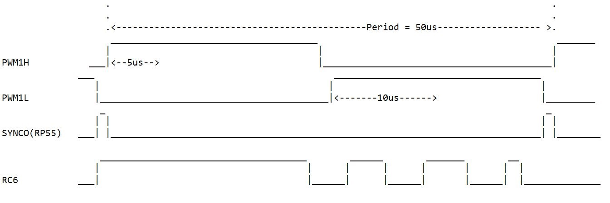

## PTG AND ADC 

## Description:

In this example, PWM1 is setup to produce pwm frequency of 20KHz (50us period). 

PWM1 is configured in Edge aligned ,complementary PWM mode and PTPER PTPER register provides 
timing for this PWM generator.SYNCO output is enabled and is mapped to RP55.

PTG Sequencer ,from the start of PWM ON time waits for 15 us, and then generate ADC triggers 
to sample analog signal 6 times.After generating every ADC trigger, sequencer is made to  wait
for ADC conversion to complete ,before generating next trigger.At the end generates a PTG Interrupt 
to process the acquired signal samples.

RC6 is toggled in ADC interrupt,and also in PTG Interrupt 0.This is done for understanding.Sample
timing diagram is shown below.
                   

This can be reconfigured according to application requirement.

## Hardware Used

- Explorer 16/32 Development Board (https://www.microchip.com/DM240001-2)
- dsPIC33EP512GM710 PIM (https://www.microchip.com/ma330035) 
	
## Software Used 

- MPLAB® X IDE v6.00 or newer (https://www.microchip.com/mplabx)
- MPLAB® XC16 v2.00 or newer (https://www.microchip.com/xc)

