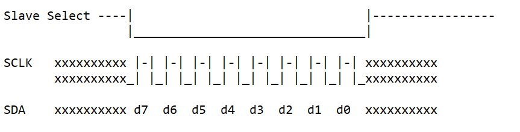
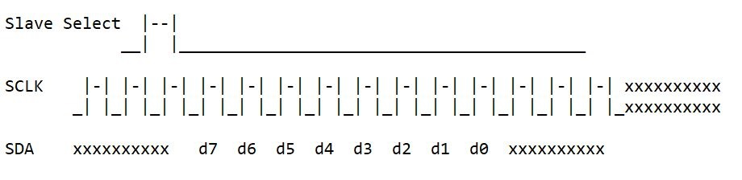

## SPI MODULE RUNNING IN DIFFERENT MODES 

## Description:

This code shows an example of running the SPI module in different modes.  The first mode is for outputting to a
single device which requires a Framed SPI mode.  

The second example is for a device which can accept a string of clocks,
but will only respond to the byte after the frame bit.

The code also goes through the 4 combinations of CKP and CKE.

## Hardware Used

- Explorer 16/32 Development Board (https://www.microchip.com/DM240001-2)
- dsPIC33EP512GM710 PIM (https://www.microchip.com/ma330035) or dsPIC33EP512MU810 PIM (https://www.microchip.com/MA330025-1) or dsPIC33EP256GP506 PIM (https://www.microchip.com/MA330030)	
	
	
## Software Used 

- MPLAB® X IDE v6.00 or newer (https://www.microchip.com/mplabx)
- MPLAB® XC16 v2.00 or newer (https://www.microchip.com/xc)

